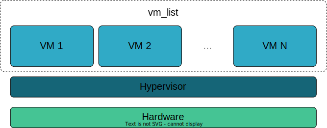

Bao Configuration File
======================

Overview
--------
The Bao hypervisor's configuration is managed through a dedicated configuration
in the form of a C source file. This section provides an in-depth
description of the various configuration options available.

The configuration file follows a specific structure, as outlined below:

.. code-block:: c

    #include <config.h>

    // Load guests' image
    VM_IMAGE(img1_name, "/path/to/vm1/binary.bin");
    VM_IMAGE(img2_name, "/path/to/vm2/binary.bin");

    struct config config = {

        // Shared memories configuration
        .shmemlist_size = N,
        .shmemlist = (struct shmem[]) {
            [0] = {/*shared memory config*/,},
            [1] = {/*shared memory config*/,},
            ...
            [N] = {/*shared memory config*/,}
        },

        // Guests Configuration
        .vmlist_size = NUM_VMs,
        .vmlist = {
            { /* VM 0 Config*/},
            { /* VM 1 Config*/},
            ...
            { /* VM N Config*/},
        }
    };

Prior to defining the ``config`` struct, it is imperative to declare the VM
images. The declaration of VM images utilizes the VM_IMAGE macro, requiring an
identifier and the respective path to the image file. In this regard, the
configuration file expects to receive a compiled image of each guest
(``.bin`` file) that will be subsequently assigned to individual VMs using the
``VM_IMAGE`` macro. For instance, the number of VM images declared may vary
between 1 and the count of CPU cores accessible in the target platform, given
that the Bao hypervisor adheres to a 1-1 CPU partitioning policy.

Afterward, the configuration allows the definition of two distinct lists: (i) a
list of shared memory regions (``shmemlist``) and (ii) a list of VMs (or
guests) (``vmlist``). While the list of shared memory regions is optional and
may be omitted from the configuration, the list of VMs is mandatory and must
include at least 1 VM. Additionally, for each list, it is necessary to specify
the list size using the parameters ``shmemlist_size`` and ``vmlist_size``.

Config file name and location
-----------------------------
The configuration file with the ``.c`` extension can be assigned various names.
As part of the Bao hypervisor's build system, it expects to find the
configuration file in the ``configs`` folder. This means that users need to
place their custom configuration files with the appropriate settings in the
designated ``configs`` directory. The build system then relies on this file to
extract and apply the desired configuration options for the hypervisor.

.. warning::
    Warning: Modifying the number of elements in the ``shmemlist`` or \
    ``vmlist`` lists, which differs from the specified sizes \
    (``shmemlist_size`` and ``vmlist_size``, respectively), may result in \
    unpredictable behavior. Ensure that any changes made to the configuration \
    are consistent with the designated sizes to avoid unexpected issues.

Guests Configuration
--------------------

Within this configuration file, it is possible to define various aspects of
your virtual environment, including hardware resources, devices, and storage
options. One of the most important features of the configuration file is the
ability to define VMs, or guests (VM 1, VM 2, ... VM N). This allows to create
and manage multiple VMs, each with its own operating system and hardware
resources.

The configuration of different guests is done by populating a struct called
*vmconfig*, as follows:

.. code-block:: c

    struct vm_config {
        struct image;
        vaddr_t entry;
        cpumap_t cpu_affinity;
        colormap_t colors;
        struct vm_platform platform;
    };

For each VM, the following parameters must be specified:

- **image** [mandatory] - corresponds to the guest image (see details in \
  `Guest Image`_)
- **entry** [mandatory] - defines the entry point address in VM's address \
  space;
- **platform description** [mandatory] - corresponds to the guest platform \
  (see details in `Virtual Machine Configuration`_);
- **cpu_affinity** [optional] - corresponds to the selection of physical CPUs \
  assigned to the virtual platform (see details in `CPU Affinity`_);
- **colors** [optional] - enables the cache coloring feature (see details in \
  `Coloring`_).

Guest Image
***********

Virtual Machine Configuration
*****************************

1. Number of vCPUs
##################

2. Memory Mapping
#################

3. Inter-Process Communication (IPC)
####################################

4. Devices
##########

5. Memory Management
####################

6. Architectural-Specific Configurations
########################################

CPU Affinity
************

Coloring
********

Shared Memory Configuration
---------------------------
