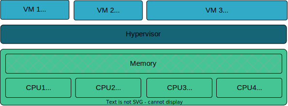

Bao Configuration File
======================

Overview
--------
The Bao hypervisor's configuration is managed through a dedicated configuration in the form of a C
source file. This section provides an in-depth description of the various configuration options
available.

The configuration file requires a global variable named ``config`` of the type ``struct config``,
which contains two distinct lists: (i) a list of shared memory regions (``shmemlist``) and (ii) a
list of VMs (``vmlist``). While the list of shared memory regions is optional and may be omitted
from the configuration, the list of VMs is mandatory and must include at least 1 VM. Additionally,
for each list, it is necessary to specify the list size using the parameters ``shmemlist_size`` and
``vmlist_size``.

.. code-block:: c

    #include <config.h>

    // Load guests' image
    VM_IMAGE(img1_name, "/path/to/vm1/binary.bin");
    VM_IMAGE(img2_name, "/path/to/vm2/binary.bin");

    struct config config = {

        // Shared memory region configuration
        .shmemlist_size = N,
        .shmemlist = (struct shmem[]) {
            [0] = {/*shared memory config*/,},
            [1] = {/*shared memory config*/,},
            ...
            [N] = {/*shared memory config*/,}
        },

        // Guests Configuration
        .vmlist_size = NUM_VMs,
        .vmlist = {
            { /* VM 0 Config*/},
            { /* VM 1 Config*/},
            ...
            { /* VM N Config*/},
        }
    };

.. warning::
    Inconsistencies between the specified list sizes (``shmemlist_size`` and ``vmlist_size``) and
    the actual sizes of their respective lists, may result in unpredictable behavior. Ensure that
    any changes made to the configuration lists' number of elements is reflected in the respective
    list size.

Before the configuration itself, it is necessary to declare the VM images using the ``VM_IMAGE``
macro. This macro directly embeds the guest binary file into the hypervisor image. Here's an example
usage of the ``VM_IMAGE``:

.. code-block:: c

  VM_IMAGE(img_name, "/path/to/VM/binary.bin");

The ``VM_IMAGE`` macro has two parameters:

1. The ``img_name``, an unique identifier associated with the image that will later be used to
describe the image running on the VM (see `Guest Image`_);

2. A C string with the guest image's binary file path. It can be either an absolute path or a path
relative to the config source file.

VM Configuration
--------------------

Bao's configuration file allows you to partition the platforms' hardware resources, such as CPU
cores, memory, or devices, by assigning them to one or more VMs. It also allows you to configure
the guest image to run on that VM. In Bao, resources are exclusively assigned to each VM, including
communication channels between two or more VMs, which may utilize shared memory or dedicated links.

|

Each entry in the ``vmlist`` mentioned earlier is a ``vm_config`` struct, which defines the
configuration of each individual guest:

.. code-block:: c

    struct vm_config {
        struct {
          vaddr_t base_addr;
          paddr_t load_addr;
          size_t size;
          bool separately_loaded;
          bool inplace;
        } image;
        vaddr_t entry;
        cpumap_t cpu_affinity;
        colormap_t colors;
        struct vm_platform platform;
    };

Each entry in this list represents a unique VM configuration, defining its image, memory address,
CPU affinity, color mapping, and platform details. For each VM, the following parameters must be
specified:

- ``image`` [mandatory] - a structure containing information about guest image loading (see details
  in `Guest Image`_)
- ``entry`` [mandatory] - defines the entry point address in VM's address space;
- ``platform description`` [mandatory] - a description of the VM platform, defining its resource
  assignments and requirements (see details in `Virtual Machine Configuration`_);
- ``cpu_affinity`` [optional] - defines the affinity of the VM's vCPUs to the physical CPUs
  assigned to the virtual platform. The affinity will be followed as best as possible, but it is
  not guaranteed (see details in `CPU Affinity`_).;
- ``colors`` [optional] - assignment of shared LLC cache colors (or partitions) to this VM (see
  details in `Coloring`_).

Guest Image
***********
.. _Guest Image:

The guest ``image`` comprises a structure that describes the image configuration running on the
guest side. It encompasses the following options:

- **image** [mandatory] - definition of the ``image`` to run on a given VM. The ``image``
  corresponds to the following structure:

.. code-block:: c

    struct vm_image {
            vaddr_t base_addr;
            paddr_t load_addr;
            size_t size;
            bool separately_loaded;
            bool inplace;
    } image;

where:

- ``base_addr`` [mandatory] - corresponds to the ``image`` load address in the VM's address space;
- ``load_addr`` [mandatory] - corresponds to the ``image`` load address in physical memory/physical
  address space. This value can be defined using the macro ``VM_IMAGE_OFFSET(img_name)``;
- ``size`` [mandatory] - corresponds to the image size. For builtin images declared using
  `VM_IMAGE`, this value can be defined using the macro ``VM_IMAGE_SIZE(img_name)``;
- ``separately_loaded`` [optional] - informs the hypervisor if the VM image is to be loaded
  separately by a bootloader; By default, separately_loaded is set as false;
- ``inplace`` [optional]- use the image inplace and don’t copy the image. By default, inplace is
  set as false;

To ensure accurate and efficient configuration of VM images, it is strongly recommended to leverage
the designated macros provided by Bao. These macros, namely ``VM_IMAGE_BUILTIN`` and
``VM_IMAGE_LOADED``, are specifically designed to simplify the image configuration process and
enhance compatibility with the hypervisor.

1. ``VM_IMAGE_BUILTIN`` - This macro simplifies image configuration by requiring only the
   ``img_name`` and the image ``base_addr``. This macro specifies both the base address and image
   size.

2. ``VM_IMAGE_LOADED`` - This macro requires additional configurations. It requires the definition
   of image ``base_addr``, the image ``load_addr``, and the image ``size``.

Using these macros not only streamlines the configuration steps but also ensures adherence to the
correct syntax and parameters. Attempting to manually configure image details without utilizing
these macros may result in errors or unintended behavior.

The integration of the appropriate macro, tailored to your specific use case, is crucial for
ensuring consistency and reliability in your VM setup. This macro should encompass essential
parameters such as ``img_name``, ``base_addr``, ``load_addr``, and size. For instance:

- ``IMAGE_BUILTIN``: Simplifies system configuration by leveraging Bao's default knowledge of the
  image location. No separate configuration or loading of guest images through a bootloader is
  required, and adjustments to the size of guest images are unnecessary.

- ``IMAGE_LOADED``: Highly recommended, especially for MPU systems, where manual allocation of
  space for the guest image can be challenging if embedded in Bao's binary. Without utilizing
  LOADED, Bao may need to copy the image, potentially resulting in wasted space.

Moreover, if the ``separately_loaded`` parameter is configured as false, the hypervisor interprets
this setting as the offset of the built-in guest image within its own image, denoted as
``VM_IMAGE_OFFSET``. During run-time, the hypervisor adjusts this value to be subsequently
interpreted as a physical address. This adjustment involves adding the address at which the
hypervisor itself was loaded. However, if the ``separately_loaded`` parameter is configured as
true, the guest image is not embedded in the hypervisor image; instead, it is loaded independently.
For more details, refer to the figure below.

|

Virtual Machine Configuration
*****************************

The VM configuration enables users to define the characteristics of each virtualized platform. It
capabilities. The virtual machine configuration is performed by populating the structure ``struct
vm_platform``, outlined below:

.. code-block:: c

    struct vm_platform {
        size_t cpu_num;
        size_t region_num;
        struct vm_mem_region* regions;
        size_t ipc_num;
        struct ipc* ipcs;
        size_t dev_num;
        struct vm_dev_region* devs;
        bool mmu;
        struct arch_vm_platform arch;
    }

By customizing this configuration, users can tailor the virtual platform to suit specific workload
requirements and application needs for their virtual machines. The configuration includes the
definition of:

- ``Number of CPUs`` - see details in `Number of vCPUs`_;
- ``Memory regions`` - see details in `Memory Regions`_;`
- ``Inter-Partition Comunication (IPC)`` - see details in `Inter-Partition Communication (IPC)`_;
- ``Devices`` - see details in `Devices`_;
- ``Architectural-Specific Configurations`` - see details in `Architectural-Specific
  Configurations`_;

1. Number of vCPUs
##################
.. _Number of vCPUs:

- ``cpu_num`` [mandatory] - defines the number of CPUs assigned to the VM;

.. warning::
  Ensure that the cumulative count of CPUs allocated across all VMs listed in the ``vmlist`` does not
  exceed the total number of available CPUs on the platform. Failing to adhere to this requirement
  might result in the guest failing to boot without any warning.

2. Memory Regions
#################
.. _Memory Regions:

For each VM, users can define multiple memory regions. To facilitate this, users first define the
total number of memory regions via the ``region_num`` parameter:

- ``region_num`` [mandatory] - defines the number of memory regions in the VM, specifically, the
  number of ``vm_mem_region`` entries in the ``vm_platform``'s ``regions`` list.

Then, each memory region is described by populating the ``struct vm_mem_region``:

.. code-block:: c

    struct vm_mem_region {
        paddr_t base;
        size_t size;
        bool place_phys;
        paddr_t phys;
    };

where:

- ``base`` [mandatory] - corresponds to the base virtual address of the memory region;
- ``size``  [mandatory] -  corresponds to the size of the memory region;

.. note::
  It is mandatory for ``base`` and ``size`` to align with the smallest page size of the architecture.
  For MMU systems, this typically aligns to 4K, while for MPU systems, it aligns to 64 bytes.

- ``place_phys`` [optional] - the memory region is mapped into the virtual memory, and it's
  important to note that the virtual address (VA) might not necessarily be the same as the physical
  address (PA). When "place_phys" is set to true, the virtual address corresponds to the physical
  address. If ``place_phys`` equals to true, it allows to specify the physical address of the
  memory region. By default, ``place_phys`` equals to false;

- ``phys`` [mandatory if ``place_phys`` is true] - it corresponds to the physical address where the
  memory region should be mapped;

.. note::
    - For enhanced performance, especially in MMU-based targets, it's recommended to align ``base``
      and ``size`` to the architecture's huge pages (e.g., 2MiB for Arm and RISC-V). Similarly, if
      ``place_phys`` is enabled, aligning ``phys`` to the architecture's huge pages can also
      improve performance.
    - In MPU systems, place_phys and phys are ignored.

The usage of ``place_phys`` and ``phys`` allows users to manually allocate memory and obtain
physical mappings. This feature provides a means to define the physical memory region explicitly.

3. Inter-Partition Communication (IPC)
######################################
.. _Inter-Partition Communication (IPC):

Inter-Partition Communication (IPC) enables communication between distinct partitions in a
computing system, facilitating data exchange, synchronization, and coordination between partitions.

.. figure:: img/ipc.svg
    :align: center
    :width: 100%
    :name: ipc-fig

|

Bao provides support for IPC, allowing VMs to establish communication channels. The IPC
configuration involves defining the number of IPCs using the ``ipc_num`` field within the
``vm_platform`` struct. The specifics of each IPC are then outlined through the ``ipcs`` structure,
including fields such as ``base``, ``size``, ``shmem_id``, ``interrupt_num``, and ``interrupts``.

- ``ipc_num`` [optional] - defines the number of IPCs assigned to the VM. By default, ``ipc_num``
  equals to zero;
- ``ipcs`` [mandatory if ``ipc_num`` > 0] - corresponds to the specification of the IPC and is
  configured through the following structure:

.. code-block:: c

    struct ipc {
        paddr_t base;
        size_t size;
        size_t shmem_id;
        size_t interrupt_num;
        irqid_t *interrupts;
    };

where:

- ``base``  [mandatory] - corresponds to the virtual base address of the IPC memory region;
- ``size`` [mandatory] - corresponds to the size of the IPC memory region;

.. note::
  The ``size`` field must be less than or equal to the size of the shared memory. Additionally, for
  MPU systems, the ``base`` field is ignored, as the region address is the same as the shared
  memory object address. Also, it is mandatory for both ``base`` and ``size`` to be aligned with
  the architecture's smallest page size. For MMU systems, this corresponds to 4K in all
  architectures, while for MPU systems, the alignment corresponds to 64 bytes.

- ``shmem_id`` [mandatory] - corresponds to the ID of the shared memory associated with the IPC;
- ``interrupt_num`` [mandatory] - defines the number of interrupts assigned to the IPC;
- ``interrupts`` [mandatory if *interrupt_num* > 0] - defines a list of interrupt IDs assigned to
  the IPC - ``(irqid_t[]) {irq_1, ..., irq_n}``;

.. warning::
  Specifying a number of interrupts in the ``interrupts`` buffer that differs from the
  ``interrupt_num`` may result in unforeseen behavior.

4. Devices
##########
.. _Devices:

- ``dev_num`` [mandatory] - corresponds to the number of devices assigned to the VM;
- ``devs`` [mandatory if *dev_num* > 0] - corresponds to the specification of the VM's devices and
  is configured through the following structure:

.. code-block:: c

    struct vm_dev_region {
        paddr_t pa;
        vaddr_t va;
        size_t size;
        size_t interrupt_num;
        irqid_t *interrupts;
        streamid_t id; /* bus master id for iommu effects */
    };

where:

- ``pa`` [mandatory] - corresponds to the base physical address of the device;
- ``va`` [mandatory] - corresponds to the base virtual address of the device;
- ``size`` [mandatory] - corresponds to the size of the device memory region;

.. note::
  It is mandatory for ``base`` and ``size`` to align with the smallest page size of the architecture.
  For MMU systems, this typically aligns to 4K, while for MPU systems, it aligns to 64 bytes.

- ``interrupt_num`` [optional] - corresponds to the number of interrupts generated by the device to
  the VM. By default, ``interrupt_num`` equals to 0;
- ``interrupts`` [mandatory if *interrupt_num*>0] - defines a list of interrupt IDs generated by
  the device - ``(irqid_t[]) {irq_1, ..., irq_n};``
- ``id`` [optional] - corresponds to the bus master id for iommu effects:

.. warning::
  Specifying a number of interrupts in the ``interrupts`` buffer that differs from the
  ``interrupt_num`` may result in unforeseen behavior.

5. Architectural-Specific Configurations
########################################
.. _Architectural-Specific Configurations:

- ``arch`` [mandatory] - allows the definition of architecture dependent configurations and is
  configured through the following structure:

.. tabs::
  .. tab:: Arm

    For the Arm architecture:

    .. code-block:: c

        struct arch_platform {
            struct gic_dscrp {
                paddr_t gicc_addr;
                paddr_t gich_addr;
                paddr_t gicv_addr;
                paddr_t gicd_addr;
                paddr_t gicr_addr;

                irqid_t maintenance_id;
            } gic;

            struct smmu_dscrp {
                paddr_t base;
                streamid_t global_mask;
            } smmu;

            struct clusters {
                size_t num;
                size_t* core_num;
            } clusters;
        };

    Where, for the GIC interrupt controller ``struct gic_dscrp`` description:

    - ``gic.gicc_addr`` [mandatory for GICv2 platforms] - base address for the GIC's CPU Interface;
    - ``gic.gich_addr`` [mandatory for GICv2 platforms] - base address for the GIC's Virtual
      Interface Control Registers;
    - ``gic.gicv_addr`` [mandatory for GICv2 platforms] - base address for the GIC's Virtual CPU
      Interface;
    - ``gic.gicd_addr`` [mandatory] - base address for the GIC's Distributor;
    - ``gic.gicr_addr`` [mandatory for GICv3/4 platforms] - base address for the GIC's
      Redistributor;
    - ``gic.maintenance_id`` [mandatory] - The interrupt ID for the GIC's maintenance interrupt;

    For the SMMU `struct smmu_dscrp`:

    - ``smmu.base`` [mandatory] - is the base address for the SMMU;
    - ``smmu.global_mask`` [optional; only valid for SMMUv2] - a mask to be applied to all SMMUv2's
      Stream Match Registers;

    Finally, when CPUs are organized in clusters, in the Arm architecture their IDs are assigned
    using an hierarchical schema. To be able to calculate the linearized ID for each core, we
    require the port to provide the number of CPUs of cluster in ascending order of AFF1.

  .. tab:: RISC-V

    For the RISC-V architecture:

    .. code-block:: c

        struct arch_platform {
            union irqc_dscrp {

                struct {
                    paddr_t base;
                } plic;

                struct {
                    struct {
                        paddr_t base;
                    } aplic;
                } aia;

            } irqc;

            struct {
                paddr_t base;      // Base address of the IOMMU mmapped IF
                irqid_t fq_irq_id;
            } iommu;

            struct {
                paddr_t base;
            } aclint_sswi;
        };

    In case the available interrupt controller is the legacy PLIC:

    - ``irqc.plic.base`` [mandatory if PLIC is available] - is the base address for the PLIC;

    In case the available interrupt controller is an AIA containing an APLIC:

    - ``irqc.aia.aplic.base`` [mandatory if APLIC is available] - is the base address for the APLIC;

    When an IOMMU is available:

    - ``iommu.base`` [mandatory if IOMMU is available] - is the base address for the IOMMU;
    - ``iommu.fq_irq_id`` [mandatory if IOMMU is available] - the Fault Queue interrupt ID (the
      current implementation assumes this is a wired interrupt);

CPU Affinity
************

The configuration file of the Bao hypervisor also enables the definition of core affinity, which
involves selecting the physical core where the guest should run.

|

This functionality is achieved through the following configuration parameter:

- ``cpu_affinity`` [optional] - corresponds to a bitmap signaling the preferred physical CPUs
  assigned to the VM. If this value is mutually exclusive for all the VMs, the physical CPUs
  assigned to each VM follow the bitmap. Otherwise (in case of bit overlap or lack of affinity
  definition), the CPU assignment is defined by the hypervisor;

Coloring
********

Cache coloring is a technique used to partition shared Last Level Cache (LLC) sets among different
guests (i.e., VMs). The main goal is to minimize cache conflicts and enhance overall system
performance by carefully assigning specific colors, representing cache sets, to different entities.
Bao supports cache coloring which can be configured using the ``colors`` field within the
``vm_config`` struct.

- ``colors`` [optional] - corresponds to a bitmap for the assigned cache colors of the VM. This
  value is truncated depending on the number of available colors calculated at run-time, i.e., its
  platform-dependent. By default, the coloring mechanism is not active. For instance, the following
  picture depicts a hypothetical setup with a 50/50 coloring scheme;

|

It's important to note that cache coloring relies on the careful assignment of colors to each VM.
However, this mechanism may not take effect if the physical mapping feature is enabled for a
specific memory region. Cache coloring exclusively operates in virtual memory systems, i.e.,
systems featuring Memory Management Units (MMUs) for address translation.

Shared Memory Configuration
---------------------------

Configuration File Location
---------------------------

The configuration files for the Bao hypervisor are stored in a designated folder known as the
configuration repository , identified by the make variable ``CONFIG_REPO``. By default, the
``CONFIG_REPO`` is set to the ``configs`` folder located in the top-level directory of the Bao
hypervisor. However, users have the flexibility to specify a different folder by setting the
``CONFIG_REPO`` option in the make command during the hypervisor building process. For instance, a
typical build command for Bao would be:

.. code-block:: console

    make PLATFORM=target-platform\
         CONFIG_REPO=/path/to/config\
         CONFIG=config-name\

Considering a configuration named ``config-name``, the configuration source file can be located in
the ``CONFIG_REPO`` directory in two formats:

**1. Single C Source File**: a C source file with the name ``config-name.c``.

**2. Directory Format**: a directory named ``config-name``  with a single ``config.c`` file within
it.
