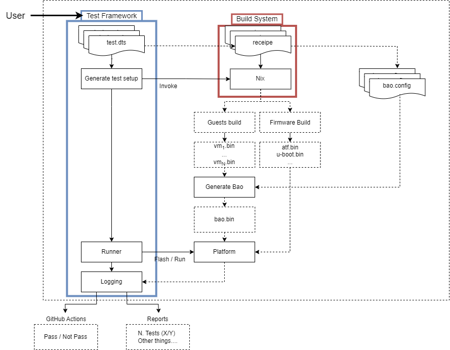

Testing
=======

*Introductory paragraph* (testing Framework on bao projects -> unit testing)
In order to tackle the challenge of testing new functionalities on the Bao hypervisor, we are actively working on the development of a comprehensive testing framework. The primary objective of this framework is to enable developers to conduct unit tests on various system components (such as the hypervisor, virtual machine (VM), and virtual machine monitor (VMM)), as well as assess interactions between different components/layers.

Test Framework
---------------

Overview
***********

The test framework API is a Python tool that acts as the control center for the testing process. It performs the following tasks:

1. **Calling the build system**: The API interacts with the build system to compile and build the different components required to perform tests. It triggers the build process, which may involve compiling source code, linking libraries, and generating the necessary artifacts for testing.

2. **Generating the test setup**: Once the build process is complete, the API generates the necessary setup for running the tests. This includes setting up the test environment, configuring test data, and preparing any required dependencies.

3. **Calling the runner**: After the test setup is prepared, the API invokes the test runner. The test runner is responsible for executing the test cases and reporting the results.

4. **Logging the results**: As the tests are executed, the API captures and logs the test results. This typically includes information such as the test status (pass/fail) and any error messages.

Overall, the test framework API serves as an intermediary between the build system, the test setup generation process, and the test runner. 
   
Concepts
*********

- Test vs Suite of tests
	- **Test** - A test is an individual evaluation carried out to confirm the operation, performance, or behavior of a particular module. It consists of compiling and executing a set of predetermined conditions and assess the outcomes with what was anticipated. A test is usually created to confirm a particular feature of the component being evaluated.

	- **Suite of tests** - A suite of tests, on the other hand, refers to a collection or group of individual tests that are organized and executed together. These tests may cover different functionalities or aspects of the module under test (MUT). A test suite allows for comprehensive testing by encompassing various scenarios, edge cases, and usage scenarios. It helps ensure that multiple aspects of the software are thoroughly examined and validated.

- Config.dts
	- **Purpose** - The configuration interface of the test framework consists of a .dts (Device Tree Source) file. The .dts file serves as a central configuration file for the framework, allowing users to define various parameters and settings related to the testing environment (e.g., target platform, logging level, tests selection, etc).
	- **Configuration fields** - *ToDo*

- Nix recipes
	- **Firmware Build** - Nix provides a powerful and reproducible way to build firmware for various platforms. A Nix recipe for firmware building typically involves the following components:

		- **Package Definitions**: The Nix recipe includes package definitions for the necessary tools and dependencies required for firmware building. This may include compilers, cross-compilers, build utilities, and specific libraries or firmware frameworks.
		- **Build Instructions**: The Nix recipe specifies the build instructions for the firmware. It describes the steps to compile the source code, generate firmware images, and perform any required post-processing tasks. These instructions ensure a consistent and reproducible build process across different environments.
		- **Configuration Options**: The Nix recipe may provide configuration options that allow users to customize the firmware build. This could include selecting specific features, enabling or disabling certain modules, or setting compile-time parameters. These options provide flexibility to tailor the firmware to specific requirements.
		- **Version Control**: The Nix recipe can integrate with version control systems, such as Git, to ensure that the firmware source code is fetched from a specific branch, tag, or commit. This helps maintain reproducibility and allows for easy updates to newer versions of the firmware.

 	- **Guests Build** - Nix is also well-suited for building virtual machine (VM) guests, such as operating systems or software stacks. A Nix recipe for guest building typically includes the following elements:

		- **Base Image Definition**: The Nix recipe specifies the base image for the guest. This can be an existing image provided by a distribution or a custom image prepared specifically for the guest build. The base image serves as the starting point for the guest build process.
		- **Package Definitions**: Similar to firmware building, the Nix recipe includes package definitions for the necessary software and dependencies required by the guest. This may encompass the operating system kernel, userland utilities, libraries, and additional applications or services.
		- **Configuration Customization**: The Nix recipe allows for customization of the guest's configuration. This includes options to specify network settings, filesystem layout, startup services, and any other relevant guest-specific configurations.
		- **Provisioning and Post-Processing**: The Nix recipe can include steps for provisioning the guest image, such as installing additional software, configuring system services, or applying security hardening measures. It may also define any necessary post-processing steps, such as compressing the image or generating a bootable ISO file.
		- **Version Control Integration**: Similar to firmware building, the Nix recipe for guest building can integrate with version control systems to ensure reproducibility and easy updates to newer versions of the guest software.

Test Definition
***************

The C code macro BAO_TEST(TEST_NAME, SUITE_NAME) provides a template for defining tests within the test framework. With this macro, test cases can be written in a standardized and consistent manner, making them more readable, maintainable, and seamlessly integrated into the test framework.

.. code-block:: c

	BAO_TEST(TEST_NAME, SUITE_NAME)
    {
    // Test implementation code goes here
    }

The macro consists of three components:

1. **BAO_TEST**: This is the name of the macro itself, serving as an identifier for the test definition.
2. **TEST_NAME**: This placeholder represents the specific name of the test case being defined. It should be replaced with a descriptive and meaningful name that reflects the purpose and functionality of the test.
3. **SUITE_NAME**: This placeholder represents the name of the test suite to which the test case belongs. Test suites group related test cases together, allowing for better organization based on functionality or the module/component being tested.

To facilitate test development, the framework already integrates the following implemented assertion functions: 

- `EXPECTED_EQUAL(x, y)` -> Checks if x is equal Y
- `EXPECTED_NOT_EQUAL(x, y)` -> Checks if x is different from Y
- `EXPECTED_TRUE(x)` -> Checks if x is true
- `EXPECTED_FALSE(x)` -> Checks if x is false
- `EXPECTED_PTR_NULL(x)` -> Checks if pointer x is NULL
- `EXPECTED_PTR_NOT_NULL(x)` -> Checks if pointer x is not NULL

Directory Structure
*******************
To effectively use the test framework, it is essential to adhere to the following directory structure:

- **ci**: This directory contains files related to continuous integration (CI) processes. It automatically executes the test framework, employing a predefined set of tests whenever a pull request (PR) is submitted to the main branch of the MUT (Modified Unit Test).

- **src**: This directory houses the source code files for the bao-hypervisor project.

- **tests**: This directory holds test-related files for the project's testing activities.

- **configs**: Within this subdirectory, you will find the configuration files (.dts configuration files) used for test setup and configuration.

- **src**: This subdirectory encompasses the source code files (.c files) that implement the tests.

- **bao-tests**: This repository contains the C infrastructure and internal workings of the "maestro," which orchestrates the entire flow of the test framework.

- **software-stack (TBD)**: This is a nix-based repository designed to conveniently fetch and build all the necessary firmware and dependencies. It ensures the reproducibility of the firmware stack and seamlessly integrates with the CI process.

The provided directory tree above represents the test framework in two distinct scenarios: running tests at the hypervisor level and running tests on the guests.

.. code-block:: yaml

	bao-hypervisor
	├── ci
	├── src
	├── tests
	│   ├── configs
	│   │   ├── cfg1.dts
	│   │   ├── cfg2.dts
	│   ├── src
	│   │   ├── src1.c
	│   │   ├── src2.c
	├── bao-tests
	├── software-stack (TBD)

.. code-block:: yaml

	├── guest-directory
	│   ├── ci
	│   ├── src
	│   ├── tests
	│   │   ├── configs
	│   │   │   ├──cfg1.dts
	│   │   │   ├──cfg2.dts
	│   │   ├── src
	│   │   │   ├──src1.c
	│   │   │   ├──src2.c
	│   ├── bao-tests
	│   ├── software-stack (TBD)

How to use
***********
0- Requirements
sudo apt install .....

1- Repository

2- Modify makefiles

3- Codegen

4- Make command

Test Implementation
-------------------
Follow Contributing Guides and the testing guidelines:
-
-
-

