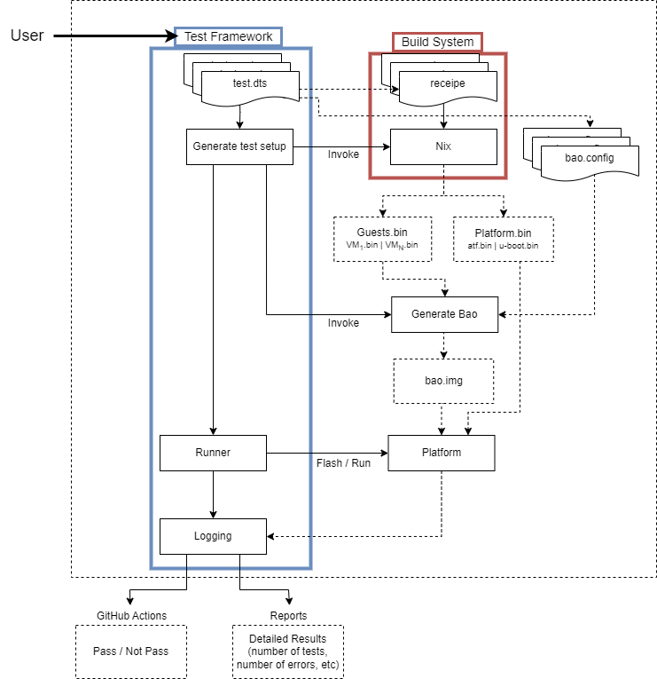

Testing
=======

In order to tackle the challenge of testing new functionalities on the Bao
hypervisor, we are actively working on the development of a comprehensive
testing framework. The primary objective of this framework is to enable
developers to conduct unit tests on various system components (such as the
hypervisor, virtual machine (VM), and virtual machine monitor (VMM)), as well
as assess interactions between different components/layers.

Test Framework
---------------

Nomenclature
*************
- **MUT**: Module Under Test;

Overview
***********

The test framework API is a Python tool that acts as the control center for the
 testing process. It performs the following tasks:

1. **Calling the build system**: The API interacts with the build system to
compile and build the different components required to perform tests. It
triggers the build process, which may involve compiling source code, linking
libraries, and generating the necessary artifacts for testing.

2. **Generating the test setup**: Once the build process is complete, the API
generates the necessary setup for running the tests. This includes setting up
the test environment, configuring test data, and preparing any required
dependencies.

3. **Calling the runner**: After the test setup is prepared, the API invokes
the test runner. The test runner is responsible for executing the test cases
and reporting the results.

4. **Logging the results**: As the tests are executed, the API captures and
logs the test results. This typically includes information such as the test
status (pass/fail) and any error messages.

    Bao test framework overview.

Overall, the test framework API serves as an intermediary between the build
 system, the test setup generation process, and the test runner.

Concepts
*********

- Test vs Suite of tests

 - **Test**: A test is an individual evaluation carried out to confirm the
   operation, performance, or behavior of a particular module. It consists of
   compiling and executing a set of predetermined conditions and assess the
   outcomes with what was anticipated. A test is usually created to confirm
   a particular feature of the component being evaluated.

 - **Suite of tests**: A suite of tests, on the other hand, refers to a
   collection or group of individual tests that are organized and executed
   together. These tests may cover different functionalities or aspects of the
   module under test (MUT). A test suite allows for comprehensive testing by
   encompassing various scenarios, edge cases, and usage scenarios. It helps
   ensure that multiple aspects of the software are thoroughly examined and
   validated.

- Config.dts

 - **Purpose** - The configuration interface of the test framework consists of
   a .dts (Device Tree Source) file. The .dts file serves as a central
   configuration file for the framework, allowing users to define various
   parameters and settings related to the testing environment (e.g., target
   platform, logging level, tests selection, etc).
 - **Configuration fields** - *ToDo*

- Nix recipes

 - **Firmware Build** - Nix provides a powerful and reproducible way to build
   firmware for various platforms. A Nix recipe for firmware building typically
   involves the following components:

  - **Package Definitions**: The Nix recipe includes package definitions for
    the necessary tools and dependencies required for firmware building. This
    may include compilers, cross-compilers, build utilities, and specific
    libraries or firmware frameworks.
  - **Build Instructions**: The Nix recipe specifies the build instructions for
    the firmware. It describes the steps to compile the source code, generate
    firmware images, and perform any required post-processing tasks. These
    instructions ensure a consistent and reproducible build process across
    different environments.
  - **Configuration Options**: The Nix recipe may provide configuration options
    that allow users to customize the firmware build. This could include
    selecting specific features, enabling or disabling certain modules, or
    setting compile-time parameters. These options provide flexibility to
    tailor the firmware to specific requirements.
  - **Version Control**: The Nix recipe can integrate with version control
    systems, such as Git, to ensure that the firmware source code is fetched
    from a specific branch, tag, or commit. This helps maintain reproducibility
    and allows for easy updates to newer versions of the firmware.

 - **Guests Build** - Nix is also well-suited for building virtual machine (VM)
   guests, such as operating systems or software stacks. A Nix recipe for guest
   building typically includes the following elements:

  - **Base Image Definition**: The Nix recipe specifies the base image for the
    guest. This can be an existing image provided by a distribution or a custom
    image prepared specifically for the guest build. The base image serves as
    the starting point for the guest build process.
  - **Package Definitions**: Similar to firmware building, the Nix recipe
    includes package definitions for the necessary software and dependencies
    required by the guest. This may encompass the operating system kernel,
    user-land utilities, libraries, and additional applications or services.
  - **Configuration Customization**: The Nix recipe allows for customization
    of the guest's configuration. This includes options to specify network
    settings, file system layout, startup services, and any other relevant
    guest-specific configurations.
  - **Provisioning and Post-Processing**: The Nix recipe can include steps for
    provisioning the guest image, such as installing additional software,
    configuring system services, or applying security hardening measures. It
    may also define any necessary post-processing steps, such as compressing
    the image or generating a bootable ISO file.
  - **Version Control Integration**: Similar to firmware building, the Nix
    recipe for guest building can integrate with version control systems to
    ensure reproducibility and easy updates to newer versions of the guest
    software.

Test Definition
***************

The C code macro BAO_TEST(TEST_NAME, SUITE_NAME) provides a template for
 defining tests within the test framework. With this macro, test cases can be
 written in a standardized and consistent manner, making them more readable,
 maintainable, and seamlessly integrated into the test framework.

.. code-block:: c

 BAO_TEST(TEST_NAME, SUITE_NAME)
 {
 // Test implementation code goes here
 }

The macro consists of three components:

1. **BAO_TEST**: This is the name of the macro itself, serving as an identifier
   for the test definition.
2. **TEST_NAME**: This placeholder represents the specific name of the test
   case being defined. It should be replaced with a descriptive and meaningful
   name that reflects the purpose and functionality of the test.
3. **SUITE_NAME**: This placeholder represents the name of the test suite to
   which the test case belongs. Test suites group related test cases together,
   allowing for better organization based on functionality or the
   module/component being tested.

The implementation of tests must follow the
`contributing guidelines <https://github.com/bao-project/bao-docs/blob/main/
source/development/contributing.rst>`_

Asserts
***********

To facilitate test development, the framework already integrates the following
 implemented assertion functions:

- ``EXPECTED_EQUAL(x, y)`` -> Checks if x is equal Y;
- ``EXPECTED_NOT_EQUAL(x, y)`` -> Checks if x is different from Y;
- ``EXPECTED_TRUE(x)`` -> Checks if x is true;
- ``EXPECTED_FALSE(x)`` -> Checks if x is false:
- ``EXPECTED_PTR_NULL(x)`` -> Checks if pointer x is ``NULL``;
- ``EXPECTED_PTR_NOT_NULL(x)`` -> Checks if pointer x is not ``NULL``;

Directory Structure
*******************
To effectively use the test framework, it is essential to adhere to the
following directory structure:

- **ci**: This directory contains files related to continuous integration (CI)
  processes. It automatically executes the test framework, employing a
  predefined set of tests whenever a pull request (PR) is submitted to the main
  branch of the MUT (Modified Unit Test).

- **src**: This directory houses the source code files for the bao-hypervisor
  project.

- **tests**: This directory holds test-related files for the project's testing
  activities.

- **configs**: Within this subdirectory, you will find the configuration files
  (.dts configuration files) used for test setup and configuration.

- **src**: This subdirectory encompasses the source code files (.c files) that
  implement the tests.

- **bao-tests**: This repository contains the C infrastructure and internal
  workings of the "maestro," which orchestrates the entire flow of the test
  framework.

- **software-stack (TBD)**: This is a nix-based repository designed to
  conveniently fetch and build all the necessary firmware and dependencies.
  It ensures the reproducibility of the firmware stack and seamlessly
  integrates with the CI process.

The provided directory tree above represents the test framework in two distinct
scenarios: running tests at the hypervisor level and running tests on the
guests.

.. code-block:: yaml

 bao-hypervisor
 ├── ci
 ├── src
 ├── tests
 │   ├── configs
 │   │   ├── cfg1.dts
 │   │   ├── cfg2.dts
 │   ├── src
 │   │   ├── src1.c
 │   │   ├── src2.c
 │   ├── bao-tests
 │   ├── software-stack (TBD)

.. code-block:: yaml

 ├── guest-directory
 │   ├── ci
 │   ├── src
 │   ├── tests
 │   │   ├── configs
 │   │   │   ├──cfg1.dts
 │   │   │   ├──cfg2.dts
 │   │   ├── src
 │   │   │   ├──src1.c
 │   │   │   ├──src2.c
 │   │   ├── bao-tests
 │   │   ├── software-stack (TBD)

How to use
***********

Lets assume you have a MUT with the following structure:

.. code-block:: bash

 /src
 README.md

1. You need to include the ``bao-tests``, and ``software-stack``
   bao-project git repositories on the root of your MUT:

.. code-block:: bash

 /bao-tests
 /software-stack
 /src
 README.md

2. You need to create a repository that will be the home of your tests and
   tests configs,
   e.g., ``/tests/src`` and ``/tests/config``, on the root of your MUT:

.. code-block:: bash

 /bao-tests
 /software-stack
 /tests/src
 /tests/config
 /src
 README.md

3. You need to add the testing framework source files and the test files to
the source files that are going to be compiled. For makefile based projects you
can follow the example below:

.. code-block:: make

  TESTF_TESTS_DIR:=$(cur_dir)/tests/src
  TESTF_REPO_DIR:=$(cur_dir)/tests/bao-tests
  include $(TESTF_REPO_DIR)/src/bao-test.mk

  SRC_DIRS+=$(TESTF_SRC_DIR) $(TESTF_TESTS_DIR)
  C_SRC+=$(TESTF_SRCS)
  INC_DIRS+=$(TESTF_INC_DIR)
  CFLAGS+=$(TESTF_FLAGS)

.. note::
  Assign the variable ``TESTF_TESTS_DIR`` with the path to the test files
  directory and ``TESTF_REPO_DIR`` to the path of the test framework
  repository. Then, you can include the file ``bao-test.mk`` which provides
  variables containing all the necessary files to be include to build system.

4. You need to write a `test configuration
   file <#test-configuration-file>`__, e.g., ``name_x.dts``, for the setup
   you want to test (suites + platform + software stack), This file should be
   placed on your test config folder, in our example ``/tests/config``.

.. code-block:: yaml

 - platform
 - recipe_test_x.nix
 - testes/suites
 - test configs

5. Write some tests, and put them on your test folder, in our example
   ``/tests/src``.

.. code-block:: bash

 cd /tests/src

 touch ABCD.c

 vim ABCD.c
  #include "testf.h"

  BAO_TEST(ABCD, TEST_A)
  {
    printf("TEST_A\n");
  }

  BAO_TEST(ABCD, TEST_B)
  {
    printf("TEST_B\n");
  }

.. note::
   You can use different pre-defined asserts, to check several
   different conditions. For example, if you want to verify if two vars
   are equal, you can use ``EXPECTED_EQUAL(x, y)``. There are more
   `asserts <#asserts>`__ to be used.

6. Run the tests

Run the test-framework with: (**To be Implemented**)

.. code-block:: bash

 make test-framework name_x.dts

Run the test-framework with docker with: (**To be Implemented**)

.. code-block:: bash

 make -C ci/docker test-framework name_x.dts

7. To run the ci on the remote repository every time you push changes, i.e.,
   perform a PR to the main branch, you need to add the following github action
   rule. (**To be Implemented**).

.. code-block:: yaml

 go to ./github/workflows/some-workflow.yml

 # Add this to your workflow
 test-framework:
   runs-on: ubuntu-latest
   container: baoproject/bao:latest
   strategy:
    matrix:
     platform: ["qemu-aarch64-virt"]
   steps:
     - uses: actions/checkout@v2
      with:
       submodules: recursive
     - run: make test-framework name_x.dts

Test Configuration File
***********************
The test configuration file is a ``.dts`` file that describes the setup to be
tested. It contains the following fields:

- **platform**: The target platform to perform the tests. See
  `Appendix I <#appendix-i>`__ to check supported platforms.

- **nix_file**: A nix recipe that describes the software stack to be used.
  This will select a pre configured bao.config or point to one of your own.

- **testes/suites**: The suites and tests to be run.

- **log_level**: Test related configurations, e.g., log level ...etc.

.. code-block:: dts

 /dts-v1/;
  / {
     platform = "qemu-aarch64-virt";

     test_config {
      recipe_test {
             nix_file = "recipe.nix";
             suites = "ABCD";
             log_level = "0";
            };
        };
    };

Appendix I
----------

.. table:: Supported Platforms
   :widths: 25 25 50

   +---------------------+-------------------+----------------------+
   |                     |     PLATFORM      |       ARCH           |
   +=====================+===================+======================+
   | QEMU Aarch64 virt   | qemu-aarch64-virt |        aarch64       |
   +---------------------+-------------------+----------------------+

