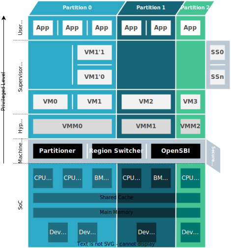

High-level System Architecture
==============================

The ... system is composed by two main components: (i) the static configuration
tool and (ii) the run-time ... . The former implements ... Regarding the
run-time system it implements ...

Block Diagram
-------------
TBD...

Arm-based Architectures
***********************

Armv8-A Family
##############

.. image:: img/sys_rt_armv8_arch.svg
      :align: center

Armv9-A Family
##############

RISC-V-based Architectures
**************************

Major Subsystems
----------------
TBD...

Partitioner
***********

Partitions
**********

VMM Static
**********

Communication Channels
**********************

Configuration Tool
******************

Protection Mechanisms
---------------------

Arm-based Architectures
***********************

Armv8-A Family
##############

.. raw:: html
   :file: prot-mech-armv8.html

Armv9-A Family
##############

.. raw:: html
   :file: prot-mech-armv8.html

RISC-V-based Architectures
**************************

.. raw:: html
   :file: prot-mech-armv8.html
